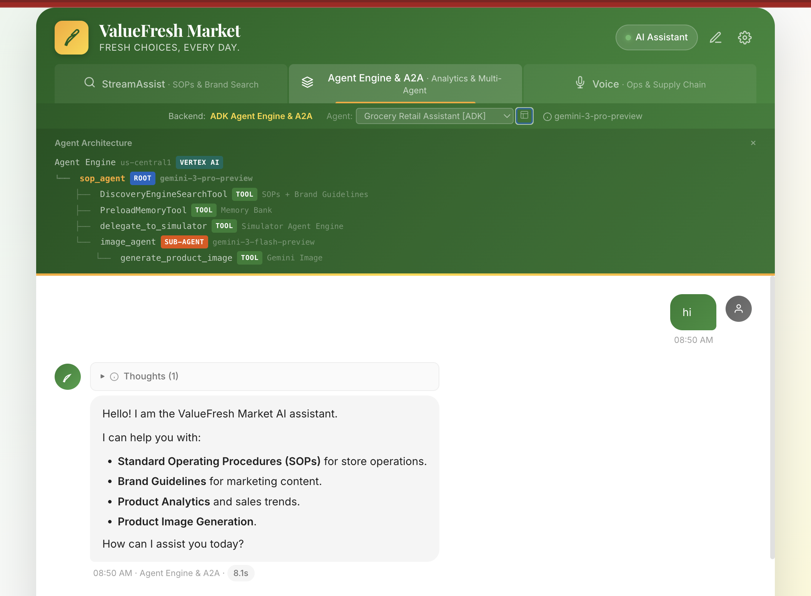
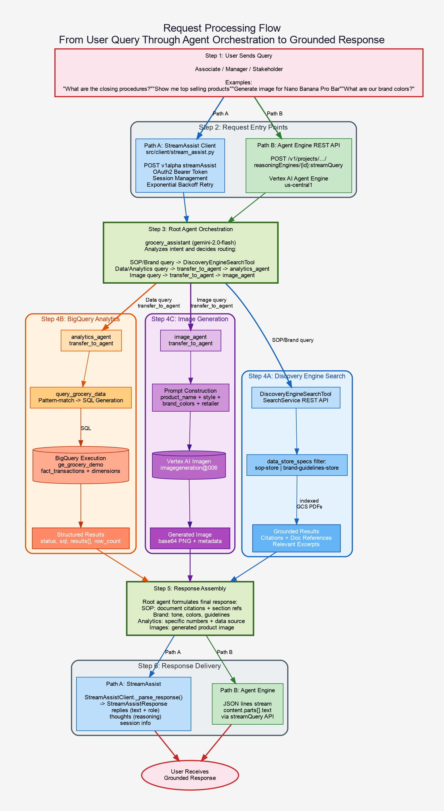
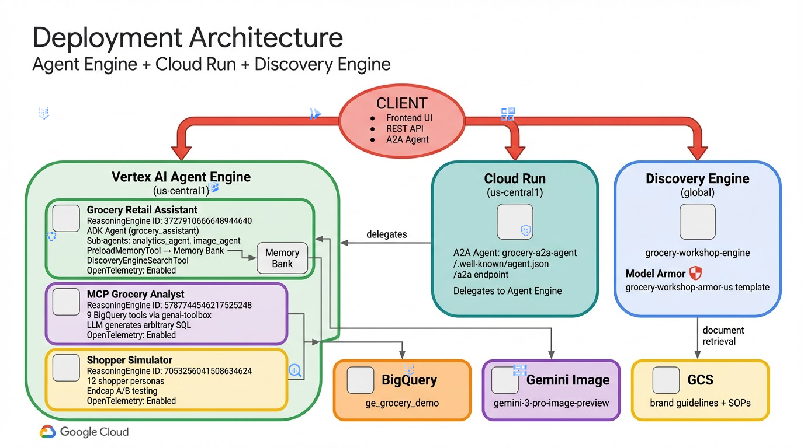
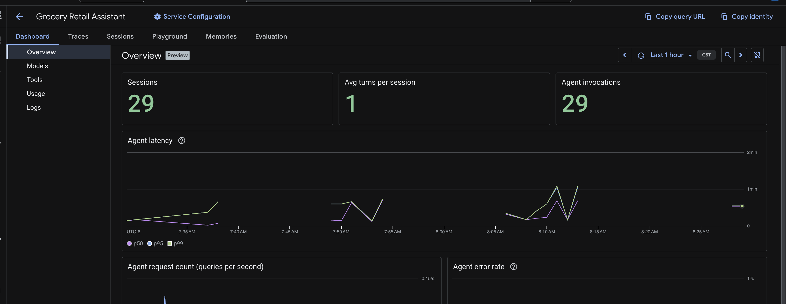
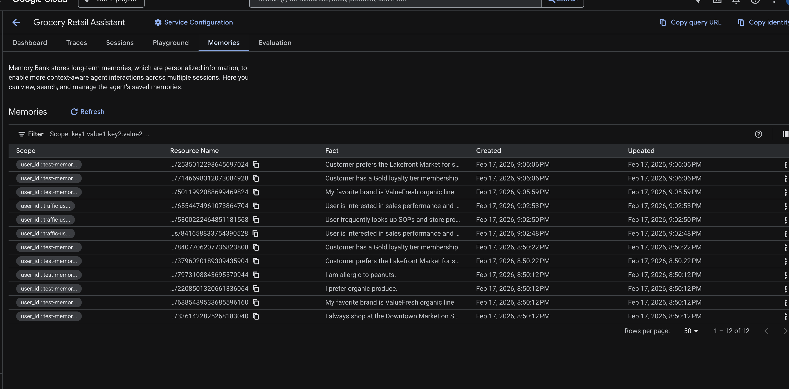
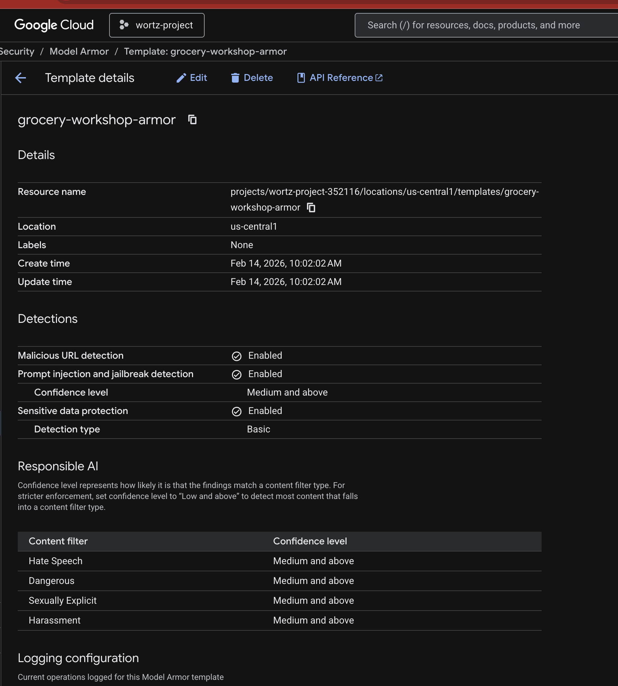

# System Architecture

> **Branding Note**: This system is powered by **Gemini Enterprise** (the product name for Google Cloud's Discovery Engine API). Throughout this document, "Discovery Engine" refers to the underlying API, while "Gemini Enterprise" is the product as presented to customers. Both terms describe the same platform.

This document describes the architecture of the Gemini Enterprise Grocery Workshop. For setup instructions, see the [Setup Guide](setup.md).

---

## Table of Contents

1. [High-Level Overview](#high-level-overview)
2. [Presentation Layer](#presentation-layer)
3. [Agent Layer](#agent-layer)
4. [Search & Retrieval Layer](#search--retrieval-layer)
5. [Data Layer](#data-layer)
6. [MCP Integration](#mcp-integration)
7. [Shopper Simulator](#shopper-simulator)
8. [A2A Agent](#a2a-agent)
9. [Deployment Architecture](#deployment-architecture)
10. [Configuration System](#configuration-system)
11. [Cross-References](#cross-references)

---

## High-Level Overview

The system is organized into four layers, each interfacing with Google Cloud services.


---

## Presentation Layer

Two interfaces for interacting with the system:

### Frontend Web UI (`src/frontend/`)

A single-page branded web application with a Python proxy server.

| File | Purpose |
|------|---------|
| [`index.html`](../src/frontend/index.html) | Chat interface with ValueFresh Market branding |
| [`server.py`](../src/frontend/server.py) | HTTP proxy using Application Default Credentials |

**Design:**
- Green (#2e7d32) / gold (#f9a825) / white color scheme
- Two backend modes: StreamAssist and Agent Engine
- Agent selector dropdown for all backends (StreamAssist agents + Agent Engine deployed agents)
- Markdown rendering via marked.js with DOMPurify sanitization
- Session management for Discovery Engine conversations
- Voice input via Gemini Live (WebSocket on port 8081) with browser TTS fallback
- Model Armor safety demo with specific filter identification
- Memory Bank tooltip showing per-user memory count
- Cloud Trace deeplinks and performance metrics for Agent Engine responses
- Client-side greeting handler for StreamAssist (friendly responses for "hi", "thanks", etc.)

**Proxy routes:**

| Frontend Route | Backend Target |
|----------------|----------------|
| `POST /api/stream-assist/sessions` | Discovery Engine `sessions` endpoint |
| `POST /api/stream-assist/query` | Discovery Engine `streamAssist` endpoint (supports `agentsSpec` routing) |
| `GET /api/stream-assist/agents` | Discovery Engine `assistants` endpoint (list available agents) |
| `POST /api/agent-engine/query` | Agent Engine `streamQuery` endpoint |
| `POST /api/agent-engine/stream` | Agent Engine SSE streaming endpoint |
| `GET /api/images/*` | GCS image proxy for generated product images |
| `GET /api/config` | Public configuration (retailer name, voice settings) |
| `GET /api/memory/status` | Memory Bank memory count for current user |
| `GET /api/health` | Health check |

```bash
# Launch
python -m src.frontend
# Open http://localhost:8080
```

### StreamAssist Python Client (`src/client/stream_assist.py`)

A programmatic REST client for the Discovery Engine `streamAssist` endpoint.

- `StreamAssistClient.from_config()` — factory method reading from `config/settings.yaml`
- `create_session()` / `query()` — session lifecycle
- `StreamAssistResponse` dataclass — parsed response with text, thoughts, session info
- Tenacity retry logic for 429/5xx errors
- Used by `tests/test_acceptance.py` for acceptance testing

---

## Agent Layer

### Gemini 3 Model Regime

All agents use the Gemini 3 model family, with model selection matched to task complexity:

| Model | Role | Used By |
|-------|------|---------|
| `gemini-3-pro-preview` | Orchestration, complex reasoning, tool use | Root agent, MCP agent, Simulator orchestrator |
| `gemini-3-flash-preview` | Fast sub-agent tasks, streaming | analytics_agent, image_agent |
| `gemini-3-pro-image-preview` | Native image generation | image_gen_tool |

### ADK Multi-Agent Architecture (`src/agent/`)

The primary agent uses Google's [Agent Development Kit (ADK)](https://google.github.io/adk-docs/) with a multi-agent design.


**Root agent** (`grocery_assistant`, Gemini 3 Pro):
- `DiscoveryEngineSearchTool` — searches SOPs and brand guidelines via Discovery Engine SearchService
- `PreloadMemoryTool` — loads user-scoped memories from Memory Bank at each turn
- `delegate_to_simulator` — delegates shopper simulation requests to the Simulator Agent Engine
- Transfers to `analytics_agent` for BigQuery queries
- Transfers to `image_agent` for product image generation

**Sub-agents** (Gemini 3 Flash):
- `analytics_agent` — `query_grocery_data` FunctionTool for BigQuery analytics
- `image_agent` — `generate_product_image` FunctionTool for brand-compliant product images via Gemini Image (`gemini-3-pro-image-preview`)

**Key design decision**: `DiscoveryEngineSearchTool` vs `VertexAiSearchTool`

`VertexAiSearchTool` adds a built-in Gemini retrieval tool that conflicts with the `transfer_to_agent` function tools injected by sub-agents. The ADK's `llm_agent.py` bypass check (`len(self.tools) > 1`) doesn't account for implicit transfer tools. `DiscoveryEngineSearchTool` is a `FunctionTool` subclass that wraps the SearchService REST API directly, avoiding this conflict entirely.

Implementation: [`src/agent/agent.py`](../src/agent/agent.py)


*Frontend architecture panel showing agent routing graph and tool invocations in real time*

### Agent Files

| File | Purpose |
|------|---------|
| [`agent.py`](../src/agent/agent.py) | Root agent + sub-agents, `_load_config()` |
| [`tools/bq_tool.py`](../src/agent/tools/bq_tool.py) | BigQuery analytics FunctionTool |
| [`tools/image_gen_tool.py`](../src/agent/tools/image_gen_tool.py) | Gemini 3 Pro Image product image FunctionTool |
| [`tools/a2a_tool.py`](../src/agent/tools/a2a_tool.py) | Simulator delegation via Agent Engine `streamQuery` |
| [`prompts/system_prompts.py`](../src/agent/prompts/system_prompts.py) | Retailer-agnostic system instructions (7 capability sections) |

---

## Search & Retrieval Layer

### Gemini Enterprise (Discovery Engine)

The Discovery Engine app `grocery-workshop-engine` provides enterprise search and conversational AI:

**Engine configuration:**
- Solution type: `SOLUTION_TYPE_SEARCH`
- App type: `APP_TYPE_INTRANET`
- Search tier: `SEARCH_TIER_ENTERPRISE`
- Location: `global`

**Data stores:**

| Store ID | Source | Content |
|----------|--------|---------|
| `sop-store` | GCS PDFs | Closing/opening procedures, safety checklists |
| `brand-guidelines-store` | GCS PDFs | Colors, typography, tone of voice, logo usage |

**API endpoints used:**

| Endpoint | Used By | Purpose |
|----------|---------|---------|
| `SearchService.search()` | `DiscoveryEngineSearchTool`, tests | Direct document search |
| `streamAssist` | StreamAssist client, frontend | Conversational search with sessions |
| `sessions` | StreamAssist client, frontend | Session lifecycle management |

---

## Data Layer

### BigQuery Star Schema

Dataset: `wortz-project-352116.ge_grocery_demo`


**Relationships:**
- `fact_transactions.store_id` → `dim_store.store_id`
- `fact_transactions.product_id` → `dim_product.product_id`
- `fact_transactions.employee_id` → `dim_employee.employee_id`
- `fact_transactions.customer_id` → `dim_customer.customer_id`
- `dim_employee.store_id` → `dim_store.store_id`
- `dim_customer.home_store_id` → `dim_store.store_id`

**Schema files:**
- DDL: [`infra/bigquery/create_schema.sql`](../infra/bigquery/create_schema.sql)
- Seed data: [`infra/bigquery/seed_data.sql`](../infra/bigquery/seed_data.sql)

### Customer Loyalty Tiers

| Tier | Description |
|------|-------------|
| Gold | Top-tier loyalty members |
| Silver | Mid-tier loyalty members |
| Bronze | Entry-level loyalty members |

---

## MCP Integration

An alternative analytics approach using the [MCP Toolbox for Databases](https://github.com/googleapis/genai-toolbox).

### Architecture


**How it works:**
1. The ADK agent spawns the `genai-toolbox` binary as a subprocess
2. Communication happens via MCP over stdio (`StdioServerParameters`)
3. The toolbox runs in `--prebuilt bigquery` mode, exposing 9 tools
4. The LLM generates arbitrary SQL queries (not pattern-matched)

**Available MCP tools:**

| Tool | Purpose |
|------|---------|
| `execute_sql` | Run SQL queries |
| `list_table_ids` | List tables in a dataset |
| `get_table_info` | Get table schema and metadata |
| `get_dataset_info` | Get dataset metadata |
| `list_dataset_ids` | List datasets in project |
| `search_catalog` | Search for tables, views, models |
| `ask_data_insights` | AI-powered data analysis |
| `forecast` | Time series forecasting |
| `analyze_contribution` | Metric contribution analysis |

**vs. Main Agent's `bq_tool.py`:**

| Aspect | `bq_tool.py` (Main Agent) | MCP Agent |
|--------|---------------------------|-----------|
| SQL generation | Pattern-matched templates | LLM-generated arbitrary SQL |
| Tool count | 1 (query_grocery_data) | 9 (full BigQuery toolkit) |
| Schema awareness | Hardcoded in tool function | Embedded in agent instruction + `get_table_info` |
| Deployment | Agent Engine compatible | Requires `toolbox` binary |

**Key files:**
- [`src/mcp_agent/agent.py`](../src/mcp_agent/agent.py) — Agent definition
- [`src/mcp_agent/tools.yaml`](../src/mcp_agent/tools.yaml) — Toolbox configuration
- [`tests/test_mcp_agent.py`](../tests/test_mcp_agent.py) — 34 unit tests

---

## Shopper Simulator

A world-model simulation agent (`src/simulator_agent/`) that simulates shoppers walking store aisles and building carts. Evaluates endcap merchandising placement strategies.


**Architecture:**
- Orchestrator agent (Gemini 3 Flash, thinking enabled) creates concurrent shopper persona sub-agents
- Each shopper walks the store layout, decides aisle-by-aisle, and builds a cart
- Aggregate metrics: endcap conversion rate, incremental revenue, ROI

**Components:**
- 12 shopper personas with research-backed distribution weights (`config/shopper_personas.yaml`)
- 9 endcap merchandising strategies (`config/endcap_strategies.yaml`)
- 3 store layouts (Downtown, Westside, Lakefront Market — 8 aisles each)

**Tools:**
- `compare_endcap_strategies` — A/B test two strategies with same shopper distribution
- `list_endcap_strategies` — Browse the strategy catalog
- `generate_simulation_report` — Chart.js HTML reports (conversion charts, ROI waterfall)
- `PreloadMemoryTool` — Cross-session user-scoped memory

**Integration with main agent:**
The root `grocery_assistant` agent delegates simulation requests via the `delegate_to_simulator` tool, which calls the Simulator Agent Engine directly using the `streamQuery` REST API.

**Deployed resource:** `projects/679926387543/locations/us-central1/reasoningEngines/7053256041508634624`

---

## A2A Agent

An A2A-enabled version of the grocery agent (`src/a2a_agent/`) for inter-agent communication, deployed on Cloud Run.

**Endpoints:**
- `GET /.well-known/agent.json` — AgentCard with capabilities and skills
- `POST /a2a` — A2A task execution endpoint

**Deployed resource:** `https://grocery-a2a-agent-in2bk2mdwa-uc.a.run.app`

Key files:
- [`src/a2a_agent/agent.py`](../src/a2a_agent/agent.py) — Agent definition + AgentCard
- [`src/a2a_agent/server.py`](../src/a2a_agent/server.py) — A2A server (uvicorn)
- [`src/a2a_agent/Dockerfile`](../src/a2a_agent/Dockerfile) — Cloud Run container

---

## Request Processing Flow

The following diagram shows how a user query flows through the system from entry to grounded response.



---

## Deployment Architecture

### Agent Engine (Production)



Four agents are deployed across Agent Engine and Cloud Run:

| Agent | Platform | Resource ID | Model |
|-------|----------|-------------|-------|
| Grocery Retail Assistant | Agent Engine | `3727910666648944640` | Gemini 3 Pro |
| MCP Grocery Analyst | Agent Engine | `5787744546217525248` | Gemini 3 Pro |
| Shopper Simulator | Agent Engine | `7053256041508634624` | Gemini 3 Pro |
| A2A Agent | Cloud Run | N/A (Cloud Run only) | Gemini 3 Pro |

All Agent Engine deployments have OpenTelemetry tracing enabled (`enable_tracing=True`) for Cloud Trace observability.


*GCP Console: Three deployed agents on Vertex AI Agent Engine*


*GCP Console: Agent Engine overview with session counts and latency metrics*

**Deployment command (main agent):**
```bash
cd src && adk deploy agent_engine \
  --project=wortz-project-352116 \
  --region=us-central1 \
  --staging_bucket=gs://wortz-project-352116-ge-workshop \
  --display_name="Grocery Retail Assistant" \
  --trace_to_cloud \
  agent
```

---

## Configuration System

All configuration flows through `config/settings.yaml` with environment variable overrides for deployment.

<!-- No dedicated diagram — see settings.yaml below -->

**No client names are hardcoded in source code.** Tests enforce this:
- `tests/test_bigquery.py` checks for forbidden names in BigQuery data
- `tests/test_agent.py` checks for forbidden names in system prompts
- `tests/test_mcp_agent.py` checks for forbidden names in MCP agent config

---

## Memory Bank

Memory Bank provides shared memory across agent sessions so the agent remembers user preferences, past interactions, and context across conversations.

### How It Works


**Key points:**
- `PreloadMemoryTool` is added to the root agent's tool list
- Memories are scoped per `user_id` — each browser gets a unique persistent ID via `localStorage`
- `VertexAiMemoryBankService` is configured at the Runner/deployment level, using the reasoning engine ID
- No separate resource provisioning needed — Memory Bank is a built-in feature of Agent Engine
- Frontend shows memory count via tooltip with `GET /api/memory/status`


*GCP Console: Agent Engine Memory Bank entries showing user-scoped memories*

**Configuration** (`config/settings.yaml`):
```yaml
memory:
  enabled: true
  location: "us-central1"   # Must match Agent Engine region
```

---

## Model Armor

Model Armor provides content safety screening on the Discovery Engine `grocery-workshop-engine` to filter prompts and responses for harmful content.

### Filters Enabled

| Filter | Purpose |
|--------|---------|
| RAI Harm Filter | Hate speech, violence, sexual content, dangerous content |
| PI & Jailbreak Filter | Prompt injection and jailbreak attempts |
| SDP Basic Filter | Sensitive Data Protection (PII detection) |
| Malicious URI Filter | Blocks malicious URLs in prompts/responses |

### Architecture

See the [Memory Bank & Model Armor diagram](diagrams/08_memory_model_armor.png) above for the full architecture.


*GCP Console: Model Armor template with RAI, PI/Jailbreak, SDP, and Malicious URI filters*

**Failure mode:** `FAIL_OPEN` — if Model Armor is unavailable, queries pass through to avoid blocking production traffic.

**Provisioning:** `bash infra/provision_model_armor.sh`

**Configuration** (`config/settings.yaml`):
```yaml
model_armor:
  enabled: true
  template_id: "grocery-workshop-armor-us"
  failure_mode: "FAIL_OPEN"
```

---

## Cross-References

| Document | Content |
|----------|---------|
| [README.md](../README.md) | Project overview, quick start, test matrix |
| [Setup Guide](setup.md) | Step-by-step provisioning instructions |
| [Workshop Guide](workshop_guide.md) | Hands-on walkthrough for potential Gemini Enterprise buyers |
| [Evaluation Guide](evaluation_guide.md) | Agent evaluation best practices and configuration |
| [Memory Bank Integration](memory_bank_integration.md) | Memory Bank setup and usage |
| [config/settings.yaml](../config/settings.yaml) | All retailer-specific configuration |
| [CLAUDE.md](../CLAUDE.md) | AI coding assistant guidance |
