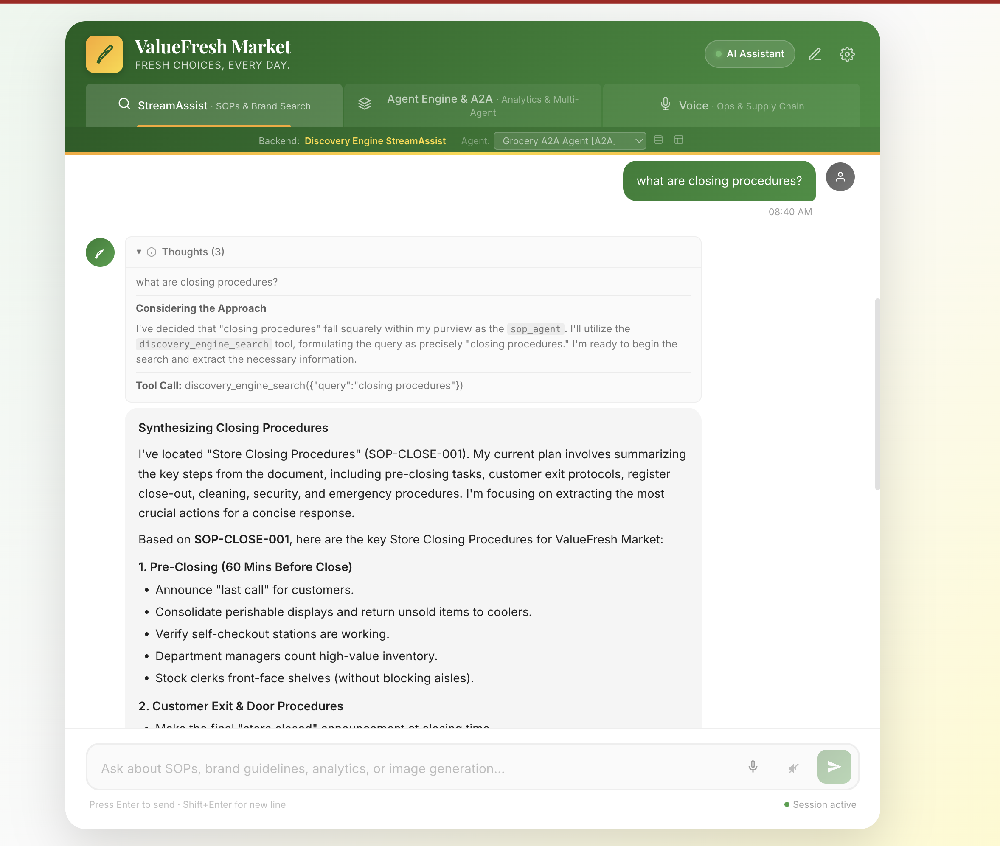
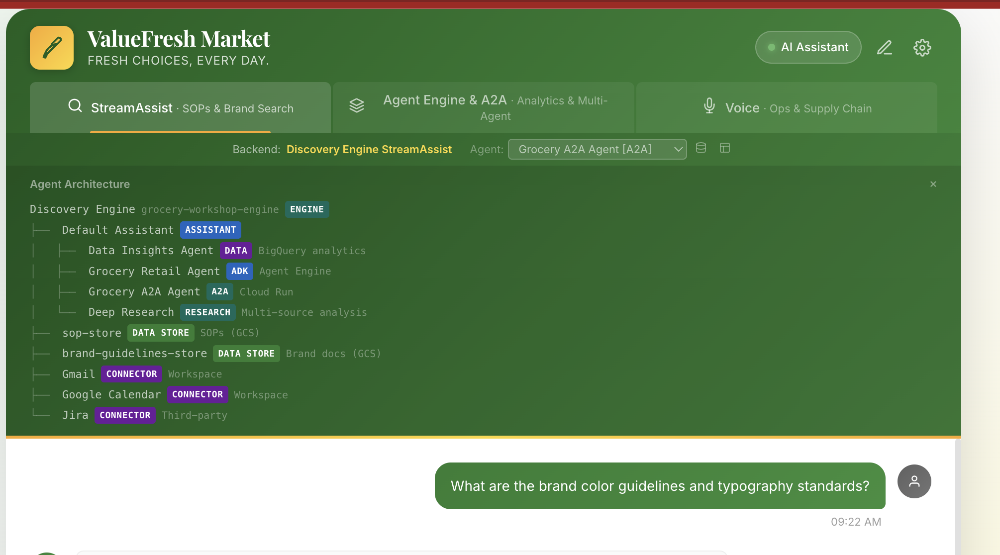
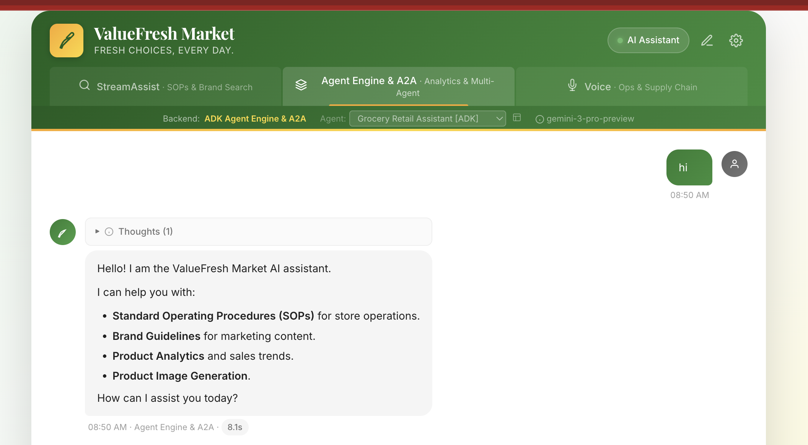
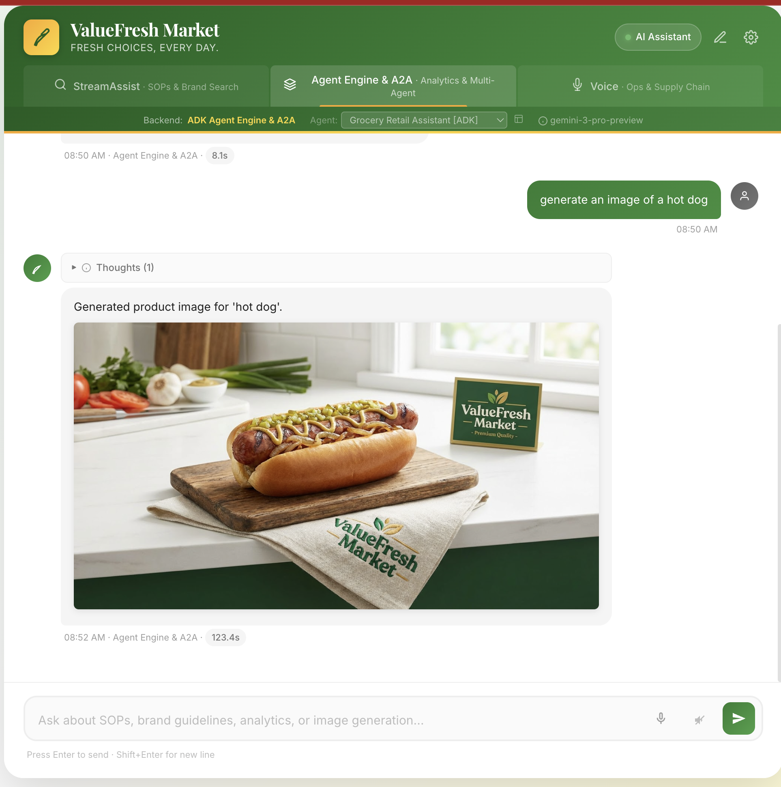
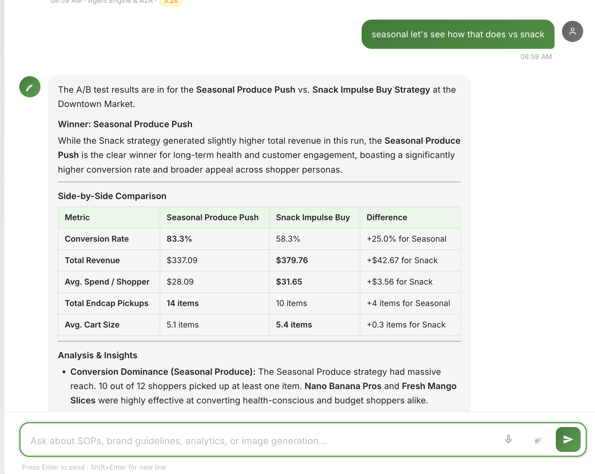
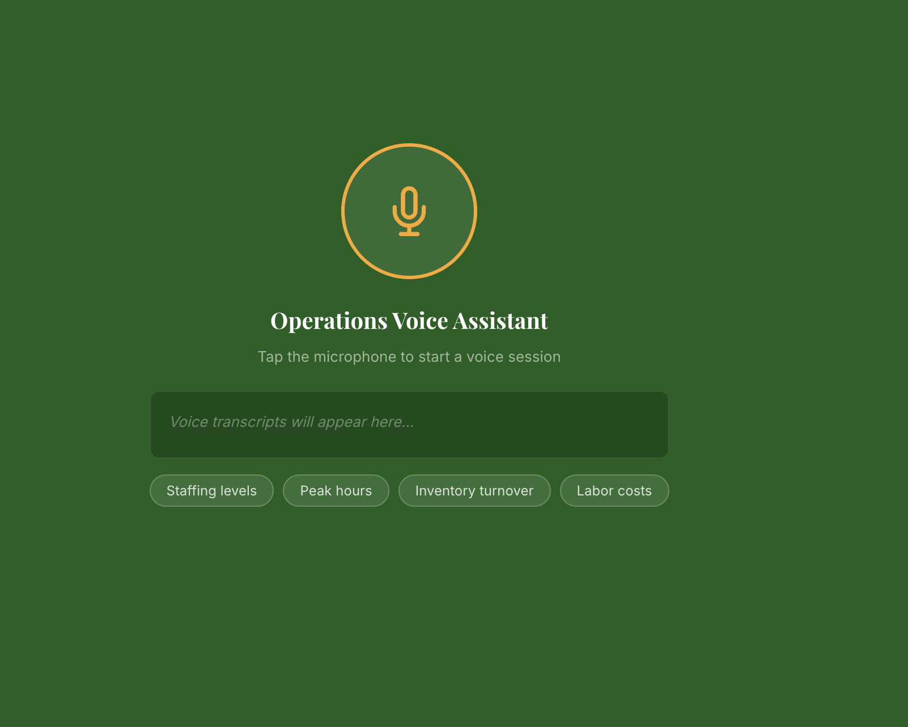
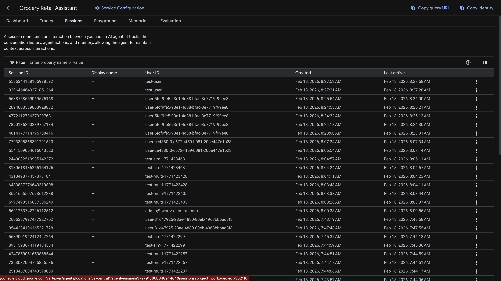

# ValueFresh Market — Gemini Enterprise Workshop Demo Script

## Overview

This demo showcases Google Cloud's agentic AI capabilities for grocery retail operations using Gemini Enterprise (Discovery Engine), Agent Engine (Vertex AI), A2A protocol, and BIDI voice streaming.

**Duration**: ~20 minutes
**Audience**: Retail CIOs, VPs of Technology, Google Cloud sales teams

---

## Part 1: StreamAssist via Discovery Engine (5 min)

### Setup
- Open browser to `http://localhost:8080`
- Ensure **StreamAssist** backend is selected (default)

### Demo Flow

*Custom frontend: StreamAssist tab with closing procedures from SOP data store*

#### 1.1 Agent Selection
- Show the **agent selector dropdown** in the status bar
- Click to see available agents (default_assistant, registered agents)
- Explain: "Each agent is a registered assistant in Gemini Enterprise with specific capabilities"

#### 1.2 Data Source Toggling
- Click the **data sources button** (database icon)
- Show the panel with connected data stores: SOPs, Brand Guidelines
- Explain: "Gemini Enterprise connects to multiple data stores — GCS PDFs, workspace connectors, and more"

#### 1.3 SOP Retrieval
- **Query**: "What is the procedure for handling expired products?"
- Expected: Grounded response from SOP documents with citations
- Highlight: Source attribution, grounded content

*Frontend architecture panel showing Discovery Engine search flow*

#### 1.4 Brand Guidelines
- **Query**: "What are the brand color guidelines for ValueFresh Market?"
- Expected: Color palette, typography, and tone of voice guidelines
- Highlight: Multi-document grounding across data stores

#### 1.5 Safety Demo (Model Armor)
- Click the **Safety Demo** buttons or type a harmful query
- Expected: Model Armor filters block unsafe content
- Show RAI Harm, PI & Jailbreak, SDP, Malicious URI filters
- Highlight: Enterprise content safety built into the platform

---

## Part 2: Agent Engine — Full ADK Agent (5 min)

### Setup
- Switch to **Agent Engine** backend using the toggle

### Demo Flow

*Agent Engine tab with personalized greeting and memory storage*

#### 2.1 Greeting & Memory
- **Query**: "Hello, I'm the new store manager at Downtown Market"
- Expected: Personalized greeting, memory stored
- Hover over the **memory tooltip** to see stored memories

#### 2.2 Sales Analytics (BigQuery)
- **Query**: "What are the top 5 best-selling products this month?"
- Expected: SQL query executed against BigQuery, formatted results with product names, quantities, revenue
- Highlight: Agent delegates to `analytics_agent` sub-agent (Gemini 3 Flash)

*ADK agent querying top 5 products with interactive Chart.js visualization*

#### 2.3 Product Image Generation
- **Query**: "Generate a product image for Nano Banana Pro energy bar"
- Expected: Image generated by Gemini 3 Pro Image and displayed inline in chat
- Highlight: Image saved to GCS, served via proxy, brand colors applied

*Gemini 3 Pro Image generating a brand-compliant product image inline*

#### 2.4 Document Search
- **Query**: "How do I handle a customer complaint about food quality?"
- Expected: SOP retrieval via DiscoveryEngineSearchTool with grounded citations
- Highlight: Same search capability as StreamAssist, but orchestrated by the agent

#### 2.5 Agent Selector
- Use the **agent selector dropdown** to switch between deployed agents (ADK, MCP, Simulator, A2A)
- **Query**: "What are the brand color guidelines?" (via MCP agent)
- Expected: MCP agent generates SQL or uses search tools for a different approach
- Highlight: Multiple agent architectures accessible from the same UI

---

## Part 3: A2A Protocol — Agent-to-Agent (3 min)

### Setup
- Stay in **Agent Engine** mode

### Demo Flow

*12 shopper personas with distinct shopping behaviors*

#### 3.1 Shopper Simulation
- **Query**: "Simulate 5 shoppers at Downtown Market with the seasonal produce endcap strategy"
- Expected: Agent delegates via `delegate_to_simulator` tool to the Simulator Agent Engine
- Simulator creates concurrent shopper personas, walks them through aisles
- Returns aggregate report: revenue, endcap conversion, recommendations
- Highlight: Multi-agent orchestration with specialized simulator agent on Agent Engine

*Side-by-side comparison of Seasonal Produce vs. Snack Impulse endcap strategies*

#### 3.2 Explain Architecture
- Explain the delegation flow:
  - Main Agent → `delegate_to_simulator` tool → Agent Engine `streamQuery` API → Simulator Agent Engine
  - Simulator has 12 shopper persona sub-agents (gemini-2.5-flash)
  - Tools: `compare_endcap_strategies` (A/B testing), `list_endcap_strategies`, `generate_simulation_report`
  - 9 endcap strategies + 3 planogram layouts for testing

---

## Part 4: BIDI Voice Streaming (3 min)

### Setup
- Ensure voice is enabled (mic button visible)
- Switch to **Agent Engine** backend (voice captures audio and sends to agent)

### Demo Flow

*Voice Ops tab with microphone interface for Gemini Live streaming*

#### 4.1 Voice Input Capture
- Click the **microphone button** in the chat input
- Speak: "What are the top selling products at Downtown Market?"
- Expected: Voice is captured via WebSocket BIDI streaming (AudioWorklet at 16kHz)
- The captured audio is streamed to the ADK agent via `Runner.run_live()` with `LiveRequestQueue`
- Agent processes the query and responds with text (and optionally audio via Puck voice)

#### 4.2 Voice + Agent Tools
- Speak: "Generate a product image for organic bananas"
- Expected: Voice input captured, transcribed, agent delegates to image_agent
- Image generated and displayed inline; agent response shown as text
- Highlight: Full agent tooling (BigQuery, image gen, search) accessible via voice

#### 4.3 Explain Architecture
- WebSocket BIDI streaming on port 8081
- ADK `Runner.run_live()` with `LiveRequestQueue` for bidirectional audio
- AudioWorklet: 16kHz PCM input capture, 24kHz PCM output playback
- Puck voice via `SpeechConfig` for natural-sounding responses
- Fallback: Browser `SpeechRecognition` → text query if WebSocket fails

---

## Part 5: Platform Deep Dive (4 min)

### 5.1 Observability

*GCP Console: Cloud Trace showing agent call flow with span details*

*GCP Console: Agent Engine sessions list with conversation history*

- Open **Cloud Trace** in GCP console
- Show traces from Agent Engine queries
- Highlight: OTel tracing enabled on all deployed agents
- Click trace deeplink from chat UI

### 5.2 Deployment Architecture
- Show the architecture diagram (`docs/diagrams/01_system_architecture.png`)
- Walk through:
  - 4 deployed agents (Main, MCP, Simulator, A2A)
  - Discovery Engine with Model Armor
  - BigQuery star schema (12K+ transactions)
  - Memory Bank for cross-session context

### 5.3 Model Regime
| Model | Role |
|-------|------|
| `gemini-2.5-pro` | Root orchestrator, complex reasoning |
| `gemini-2.5-flash` | Sub-agents (analytics, image routing) |
| `gemini-2.0-flash` | Native image generation |

---

## Troubleshooting

| Issue | Fix |
|-------|-----|
| StreamAssist returns "No response" | Check session creation, try switching agents |
| Image doesn't display | Check GCS proxy at `/api/images/`, verify GCS bucket permissions |
| Voice falls back to browser TTS | Check WebSocket at ws://localhost:8081, check server logs |
| Agent Engine 502 | Check Agent Engine deployment status, verify resource IDs in config |
| "Token count exceeds maximum" | Session has too much context; start a new session |

---

## Key Talking Points

1. **Gemini Enterprise** — Enterprise-grade conversational AI with grounded search, content safety, and multi-agent orchestration
2. **Agent Engine** — Deploy and manage ADK agents at scale with built-in tracing, memory, and evaluation
3. **A2A Protocol** — Agent-to-agent communication for complex multi-agent workflows
4. **Model Armor** — Content safety filters (RAI, PI/Jailbreak, SDP, Malicious URI) built into the platform
5. **Memory Bank** — Cross-session, user-scoped memory for personalized experiences
6. **Gemini 3** — Latest model family with native image generation, extended thinking, and 2M token context
